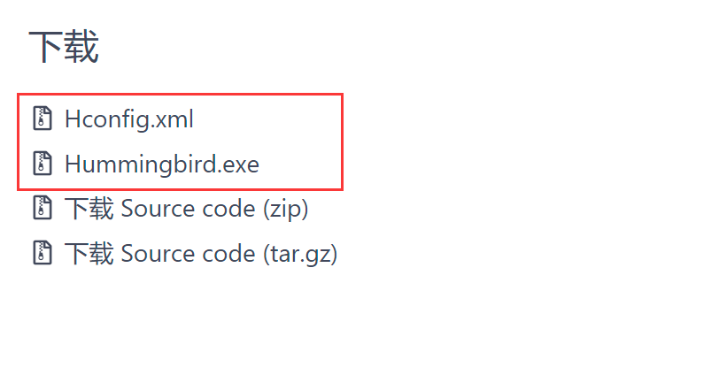
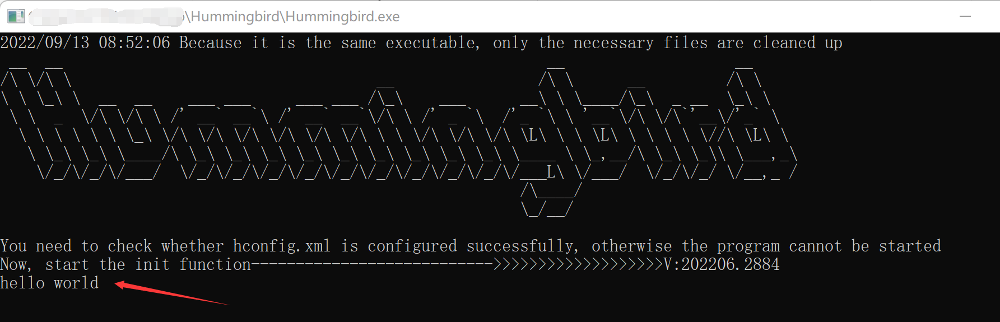
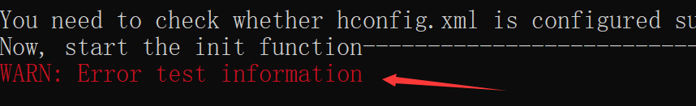

# Hummingbird
---

 - 介绍：

Hummingbird 是一套开源 的JavaScript 运行引擎。设计的初衷是为了敏捷开发，尽量做到省时省力。

 - Hummingbird 可以做什么？

1. 搭建你所需的网络测试平台，集成tcp,http,udp客户端与服务端
2. 监控本地资源，分析程序内存大小，可对其重启操作。
3. 内置mysql驱动模块，通过内置api可以轻松调用。

 - 为什么用Hummingbird ？
 
  1. 一旦保存编辑的代码，即可快速编译运行，无需手动编译。
  2. 无需记住过多API,采用xml配置方式快速完成初始化。
  3. 避免回调地狱，改造Node.js的原有api,将异步函数改为同步。


Hummingbird只遵循一种原则：**简单易用**。

> 欢迎大家 Star或Fork ：[https://gitee.com/QdbcShen/hummingbird](https://gitee.com/QdbcShen/hummingbird)

## 快速开始
**目标：** 向控制台输出hello world
1. 下载红色边框内的执行程序：
[https://gitee.com/QdbcShen/hummingbird/releases/](https://gitee.com/QdbcShen/hummingbird/releases/)


2. 在Hummingbird程序路径下创建Hconfig.xml,内容如下：
```xml
<?xml version="1.0" encoding="utf-8"?>
<Hummingbird vesion="13">
    <jsinit>
    </jsinit>
    
    <jscode loadfromfile="">   
        <script>
            function init() {
                console.log("hello world")
            }
        </script>
    </jscode>

    <jsparams>
    </jsparams>
</Hummingbird>
```
3. 启动Hummingbird，在控制台你会看到打印字符串

	
## Hconfig.xml说明
###  Hconfig.xml的基础框架
	
在上面的标题下，贴的Hummingbird依赖的基础xml文件。下面介绍Hconfig.xm里面的内容：

第一行为程序xml版本号，编码默认utf-8
	
```xml
	<?xml version="1.0" encoding="utf-8"?> 
	
```
	
标签Hummingbird为根节点，vesion为版本号。

```xml
	<Hummingbird vesion="13"></Hummingbird>
```
	
Hummingbird标签有三个标签：分别为jsparams，jscode，jsinit。这三个标签建议不要缺少，因为他们是保证Hummingbird运行基础标签。
	

###  jsinit标签
用以配置js代码初始化工作，不需要写相关的js的代码。配置相关标签即可完成初始化。以下包含与初始化有关的子标签。
#### Interval定时器标签
- 示例：配置定时器的时间：1秒在标签写上1s。

```xml
 <Interval>
    1s
</Interval>
```
- 说明：标签内可写内容为数字加上时间单位，单位需要小写，仅支持以下单位：秒（s），分（m），时（h）。配置完成后，会触发回调Interval函数。

#### log日志标签
-  示例：设置日志保存时间为48小时，分割时间为24小时
```xml
 <jsinit>
      <log maxage="48" rotationTime="24"/>
 </jsinit>
```
-  说明：属性maxage为日志分割时间，单位48小时。属性RotationTime    若此项不配置，日志为24小时保存一次，永久保存。
#### Database连接数据库标签
- 示例：连接本地mysql下的test库
```xml
 <Database>
        <conname>root:@(127.0.0.1:3306)/test</conname>
 </Database>
```

-  说明：子级标签conname中写入数据库连接url，即可连接成功mysql。后续调用js函数访问数据库。

#### http标签
- 示例：绑定http服务器端口8080
```xml
  <http bindaddress="localhost:8080"/>
```

- 说明：属性bindaddress表示绑定服务器的地址，用ip加端口号表示。这里开启http服务，会触发回调httprecv函数。
#### tcp标签
-  示例：绑定tcp服务60000端口
```xml
  <tcp bindaddress="localhost:60000"/>
```

-  说明：属性bindaddress表示绑定服务器的地址，用ip加端口号表示。这里开启tdp服务，会触发回调tdprecv函数。

----
-   示例： 连接端口为60000的tcp服务
```xml
   <tcp connect="localhost:60000"/>
```

-  说明：属性connect表示连接哪台服务，用ip加端口号表示。后续可通过内置tcp对象读取或发送网络数据。
#### udp标签
-  示例：绑定udp服务60000端口
```xml
  <udp bindaddress="localhost:60000"/>
```

-  说明：属性bindaddress表示绑定服务器的地址，用ip加端口号表示。这里开启udp服务，会触发回调udprecv函数。

----
-   示例： 连接端口为60000的udp服务
```xml
   <udp connect="localhost:60000"/>
```

-  说明：属性connect表示连接哪台服务，用ip加端口号表示。后续可通过内置ucp对象读取或发送网络数据。
### jscode标签
用以放置执行的JavaScript（简称js）代码和相关js引用。属性loadfromfile用于加载外部js文件。以下为子标签。

#### script标签

 - script标签无属性，标签内部编写js代码。**若同时使用jscode的loadfromfile属性，loadfromfile中加载的js代码将失效。**
 - 属性src可以引用外部的js代码，有http访问或者本地文件加载两者方式。

下面代码为通过http访问的方式引用moment.js模块
```xml
<script src="http://cdn.staticfile.org/moment.js/2.24.0/moment.js"/>
```

### jsparams标签
用以使用Hconfig.xml内部的参数数据。以下为子标签。
#### params标签
 - 示例：设置id为学生，姓名lixiang(理想)，年龄20的参数数据。
```xml
 <params id="student">
        <arg>lixiang</arg>
        <arg>20</arg>
  </params>
```

 - 说明：属性id数参数的唯一标识，可定义多个params，不能重复。子级标签arg写入参数值。通过Getjsparamsbyid函数传入属性id，返回对象属性获取arg数值。

## API接口
### 初始化及网络回调函数
#### init 初始化
```javascript
	function init() {}
```
参数:无

---
说明：子标签script下的init函数在jsinit配置项下的所有配置完成后触发调用。
 
 示例：引用moment.js模块，并在init函数中输出格式化时间。仅展示代码 部分。
```xml
<script src="http://cdn.staticfile.org/moment.js/2.24.0/moment.js"/>
<script>
function init() {
	console.log(moment().format('YYYY-MM-DD HH:mm:ss'))
}
</script>
```
#### httprecv 服务端接受http数据
```javascript
function httprecv(req,res){}
```
参数req:接受客户端的请求数据

类型：Object

包含的属性：
|属性名| 类型 |备注|
|--|--|--|
| Body | string |http请求体的body数据|
| Method| string |http请求方式：post,get等|
| Path| string |url的路由路径|
| Querys| object| 请求的查询参数|
| RemoteAddr| string | 请求地址，这里地址包含端口号。|

---
参数res:返回客户端的数据

包含的属性：
|属性名| 类型 |备注|
|--|--|--|
| write(string)| function |向客户端发送数据，数据类型为字符串|
---
说明：在使用tcprecv函数前，需设置tcp标签绑定端口。子标签script下的tcprecv函数在接受客户端数据时触发调用。
 
 示例：服务端绑定60000端口，接受客户端数据并向客户端发送数据。仅展示代码部分和配置项。
```xml
<jsinit>
<http bindaddress="localhost:8080"/>
</jsinit>
```
```xml
<script>
function httprecv(req,res){
	console.log(JSON.stringify(req));
	res.write("hello world")
}
</script>
```

#### tcprecv 服务端接受tcp数据
```javascript
function tcprecv(req,res){}
```
参数req:接受客户端的请求数据

类型：Object

包含的属性：
|属性名| 类型 |备注|
|--|--|--|
| Address| string |服务器地址，包括端口|
| Data| string |接受到客户端的数据|

---
参数res:返回客户端的数据

类型：Object

包含的属性：
|属性名| 类型 |备注|
|--|--|--|
| write(string)| function |向客户端发送数据，数据类型为字符串|
---
说明：在使用tcprecv函数前，需设置tcp标签绑定端口。子标签script下的tcprecv函数在接受客户端数据时触发调用。
 
 示例：服务端绑定60000端口，接受客户端数据并向客户端发送数据。仅展示代码部分和配置项。
```xml
<jsinit>
<tcp bindaddress="localhost:60000"/>
</jsinit>
```
```xml
<script>
function tcprecv(req,res){
	console.log(JSON.stringify(req));
	res.write("hello world")
}
</script>
```
#### udprecv 服务端接受udp数据
```javascript
function udprecv(req,res){}
```
参数req:接受客户端的请求数据

类型：Object

包含的属性：
|属性名| 类型 |备注|
|--|--|--|
| Address| string |服务器地址|
| Port|int|客户端端口号|
| Data| string |接受到客户端的数据|

---
参数res:返回客户端的数据

类型：Object

Object属性：
|属性名| 类型 |备注|
|--|--|--|
| write(string)| function |向客户端发送数据，数据类型为字符串|
---
说明：在使用udprecv函数前，需设置udp标签绑定端口。子标签script下的udprecv函数在接受客户端数据时触发调用。
 
 示例：服务端绑定60000端口，接受客户端数据并向客户端发送数据。仅展示代码部分和配置项。
```xml
<jsinit>
<udp bindaddress="localhost:60000"/>
</jsinit>
```
```xml
<script>
function udprecv(req,res){
	console.log(JSON.stringify(req))
	res.write("hello world")
}
</script>
```

### 系统相关与资源监控
#### tcp对象
用于发送tcp数据的对象。其属性如下：
|属性名| 类型 |备注|
|--|--|--|
| write(string)| function |向服务端发送数据，数据类型为字符串|
| read()| function |接受服务端数据，如果接收不到数据，为阻塞状态|
---
说明：在使用tcp对象前，需设置tcp标签的连接端口。
 
示例：向务端60000端口发送和读取数据。仅展示代码部分和配置项。
```xml
   <jsinit>
        <tcp connect="localhost:60000"/>
    </jsinit>
```
```xml
<script>
function init(){
	 var data =  tcp.write("hello world").read()
     console.log(data)
}
</script>
```

#### upd对象
用于发送udp数据的对象。其属性如下：
|属性名| 类型 |备注|
|--|--|--|
| write(string)| function |向服务端发送数据，数据类型为字符串|
| read()| function |接受服务端数据，如果接收不到数据，为阻塞状态|
---

说明：在使用udp对象前，需设置udp标签的连接端口。
 
示例：向务端60000端口发送和读取数据。仅展示代码部分和配置项。
```xml
   <jsinit>
        <udp connect="localhost:60000"/>
    </jsinit>
```
```xml
<script>
function init(){
	 var data =  udp.write("hello world").read()
     console.log(data)
}
</script>
```


#### HttpSend 向服务发起请求
```javascript
HttpSend(method,url,msg)
```
参数method:http请求方式，填post,get等小写字符串

类型：String

---
参数url:http请求地址，可在后面拼接查询参数

类型：String

---
参数msg:在http的body中写入数据，一般填json

类型：String

---
返回值：无

---
应用：模拟向http服务器发起请求数据。


示例：用get方式向服务器发送姓名为张三（zhangsan）的查询参数
```xml
<script>
function init() {
	HttpSend("GET","http://127.0.0.1:8080/index?name=zhangsan") 
}
</script>
```


#### Getmemory 获取内存大小
```javascript
Getmemory(programname)
```
参数programname:程序名

类型：String

---
返回值：返回某进程内存大小，如果此进程不存在，返回值为-1。

类型：int

---

限制：无法获取多个重名进程的内存大小。

示例：获取Notepad++内存大小
```javascript
function init() {
	var memsize = Getmemory("Notepad++.exe")
	console.log(memsize + "KB");
}
```
#### Restartprocess 重启进程
```javascript
Restartprocess(fullname)
```
参数fullname:程序的完整路径名，路径斜杠使用正斜杠

类型：String

---
返回值：无

---
示例：重启Notepad++进程 
```javascript
function init() {
	Restartprocess("C:/Program Files/Notepad++.exe")
}
```
#### Restartservice 重启服务

```javascript
Restartservice(servicename)
```

参数servicename:服务名

类型：String

---
返回值：无

---
限制：使用此函数重启服务需要管理员权限。若服务不存在则无法启动，服务未运行则会启动，服务运行则重启启动。

---
示例：重启MySQL服务
```javascript
function init() {
	Restartservice("MySQL")
}
```
#### filemove 移动文件

```javascript
filemove(src,dst)
```

参数src：原先文件的完整路径名，路径斜杠使用正斜杠

类型：String

参数dst：目的文件的完整路径名，路径斜杠使用正斜杠

类型：String

---
返回值：无

---
示例：将Hummingbird图片从D盘1目录移动到2目录
```javascript
function init() {
	filemove("D:/1/Hummingbird.jpg","D:/2/NewHummingbird.jpg")
}
```
#### findfiles 查找文件名
```javascript
findfiles(filename)
```
参数filename:文件完整路径名，路径斜杠使用正斜杠。文件名支持通配符匹配规则

类型：String

---
返回值：返回匹配的文件名字符串数组

类型：Array

---

示例：查询以1开头的所有图片
```xml
 <script>
<![CDATA[ 
function init() {
	var pics =  findfiles("D:/ftp/1*.jpg")
	for (var i = 0; i < pics.length; i++) {
		console.log(JSON.stringify(pics[i]));
	}
}
]]>
</script>
```
#### copyfile 复制文件

```javascript
copyfile(src,dst)
```

参数src：原先文件名，路径斜杠使用正斜杠

类型：String

参数dst：复制的目的文件名，路径斜杠使用正斜杠

类型：String

---
返回值：无

---
示例：将Hummingbird图片从D盘1目录复制到2目录
```javascript
function init() {
	filemove("D:/1/Hummingbird.jpg","D:/2/NewHummingbird.jpg")
}
```
#### writefile 写入文件

```javascript
writefile(filename,data)
```

参数filename：文件的完整路径名，路径斜杠使用正斜杠

类型：String

参数data：写入文件的内容，编码为utf-8格式

类型：String

---
返回值：无

---

限制：写入的文件名所在的路径必须存在。如果文件的内容已经存在，则会覆盖写入

---
示例：在D盘下写入一段内容
```javascript
function init() {
	writefile("D:/1/1.txt","hello Hummingbird")
}
```
#### readfile  读取文件

```javascript
readfile(filename)
```

参数filename：文件的完整路径名，路径斜杠使用正斜杠

类型：String

---
返回值：文件内容，编码为utf-8格式

类型：String

---
示例：读取D盘下的文件内容
```javascript
function init() {
	console.log(readfile("D:/1.txt")); 
}
```
#### filestate 获取文件信息
```javascript
filestate(filename)
```

参数filename：文件的相对或者绝对路径，路径斜杠为正斜杠

类型：String

---
返回值：文件信息对象

类型：Object

Object属性：
|属性名| 类型 |备注|
|--|--|--|
| IsDir| Boolean|是否是目录，真（ture）是目录，假（false）为文件|
| ModTime| String|文件修改的时间，时间格式：YYYY-MM-DD HH:mm:ss.SSS|
| Name| String|文件名|
|Size|Int|文件大小，单位是字节|
---

应用：读取存在的文件中的内容，以字符串返回

---
示例：输出D盘下的图片文件信息
```javascript
function init(){
	var info = filestate("D:/1.jpg")
	console.log(JSON.stringify(info));
}
```
#### dirstate 获取目录下所有文件信息
```javascript
dirstate (filename)
```

参数filename：目录相对或者绝对路径，路径斜杠为正斜杠

类型：String

---

返回值：目录信息对象**数组**

类型：Object

数组中Object属性：
|属性名| 类型 |备注|
|--|--|--|
| IsDir| Boolean|是否是目录，真（ture）是目录，假（false）为文件|
| ModTime| String|目录修改的时间，时间格式：YYYY-MM-DD HH:mm:ss.SSS|
| Name| String|目录或文件名|
|Size|Int|文件或目录大小，单位是字节|
---

示例：遍历输出D盘下的文件以及目录信息
```xml
 <script>
<![CDATA[ 
		function init(){
            var infos = dirstate("D:/ftp/")
            for(var i = 0;i < infos.length;i++){
                console.log(JSON.stringify(infos[i]));
            }
        } 
]]>
</script>  
```
#### mkdir  创建目录
```javascript
mkdir(filename)
```

参数filename：目录相对或者绝对路径，路径斜杠为正斜杠

类型：String

---

返回值：无

---

示例：遍历输出D盘下创建目录1及子级目录2
```javascript
function init(){
	mkdir("D:/1/2")
} 
```
#### filerename 重命名文件或目录
```javascript
filerename (src,dst)
```

参数src：要修改的文件/目录名，需拼接所在路径的相对或者绝对路径，路径斜杠为正斜杠。
类型：String

---
参数dst：修改后的文件/目录名，需拼接所在路径的相对或者绝对路径，路径斜杠为正斜杠。
类型：String

---

返回值：无

---

示例：将D盘下创建目录1改为目录2
```javascript
function init(){
	filerename("D:/1","D:/22")
} 
```
#### fileremove 删除文件或者目录
```javascript
filerename (filename)
```

参数filename：文件/目录名，需拼接所在路径的相对或者绝对路径，路径斜杠为正斜杠。
类型：String

---

返回值：无

---

示例：删除D盘下的目录1
```javascript
function init(){
	fileremove("D:/1")
} 
```
#### RemoveBeforeHour 删除几小时之前的文件
```javascript
RemoveBeforeHour(filename,hour)
```
参数filename：文件/目录名，需拼接所在路径的相对或者绝对路径，路径斜杠为正斜杠。
类型：String

---

参数hour：删除文件的小时数
类型：Int

---

返回值：无

---

示例：删除D盘下的目录1中一小时之前的文件
```javascript
function init(){
	RemoveBeforeHour("D:/1",1)
} 
```
#### sleep 程序睡眠

```javascript
sleep(Millisec)
```

参数Millisec：让程序自动暂停毫秒数

类型：int

---
返回值：无

---
应用：在js代码运行期间，通过调用此函数暂停一段时间。

---
示例：让程序暂停一秒钟
```xml
<script>  
function init() {
	sleep(1000); 
}
</script>
```
#### Getjsparamsbyid 获取xml中jsparams的子标签参数
```javascript
	function Getjsparamsbyid(id)
```
参数id:填写子标签params标签的id属性值

---
 
 示例：根据id为student,获取学生的姓名与年龄，仅展示代码部分和配置项。
```xml
<params id="student">
	<arg>lixiang</arg>
	<arg>20</arg>
</params>
```
```xml
<script>    
function init(){
	var student =  Getjsparamsbyid("student")
	console.log("name:",student[0],"age:",student[1])
	} 
</script>
```
### log 向log文件下写入当天的info日志
```javascript
log(data)
```

参数data：与console.log类似，可传入任意类型，若有多个参数，以逗号间隔。

类型：any

---
返回值：无

---
示例：向日志中写入字符串
```xml
<script>  
function init() {
	log("hello wolrd"); 
}
</script>
```

### 数据库
#### mysql对象
用于操作mysql数据库。其属性如下：
|属性名| 类型 |备注|
|--|--|--|
| exec(string)| function |执行sql语句，常用于update,insert,delete等|
| select(string)| function |执行并查询sql语句，返回值为对象数组，常用于select|
---
说明：在使用mysql对象前，需设置Database标签的连接数据库。数据库编码建议使用utf-8
 
示例：连接test数据库,创建学生表（student)，插入与查询学生信息。
```xml
<Database>
	<conname>root:@(127.0.0.1:3306)/test</conname>
</Database>
```
```xml
<script>    
function init(){
	create()
	insert()
	select()
} 
</script>
<script>
function create(){
var sql =  "CREATE TABLE `student`  ( " +
           " `name` varchar(255) CHARACTER SET utf8 COLLATE utf8_general_ci NULL DEFAULT NULL,"+
           " `age` int(11) NULL DEFAULT NULL" +
           ") ENGINE = InnoDB CHARACTER SET = utf8 COLLATE = utf8_general_ci ROW_FORMAT = Compact;"
	Mysql.exec(sql)
}
</script>
<script>
function insert(){
	var sql ="INSERT INTO student VALUES('张三', 18)"
	Mysql.exec(sql)
}
	</script>
	<script>
<![CDATA[ 
function select(){
var sql ="SELECT * FROM student"
var stus =  Mysql.select(sql)
for (var i = 0; i < stus.length; i++) {
	console.log(JSON.stringify(stus[i]));
	} 
}
]]>
</script>
```
## 补充

 - js只兼容到es5，暂不支持es6。
 - 写js程序时建议加上\<![CDATA[ ]]>标签，以防止与xml标签冲突。
- 更多是示例转至源码中example中阅览，地址[https://gitee.com/QdbcShen/hummingbird/tree/master/example](https://gitee.com/QdbcShen/hummingbird/tree/master/example)
- console.log并不能铺开对象属性，需要手动将其转成json字符串。
- js调用的api函数的调试信息在log下的debug中。
- 所有的异常均在控制台界面以红色字体显示，并捕捉到在log下的warn日志中。

---
示例：手动抛出一段测试异常，在控制台中看到红色警告提示。
```xml
<script>  
function init() {
	throw "Error test information"
}
</script>
```



## 开源许可
 遵循 Apache-2.0 开源协议，细节请阅读项目中的 LICENSE 文件内容。